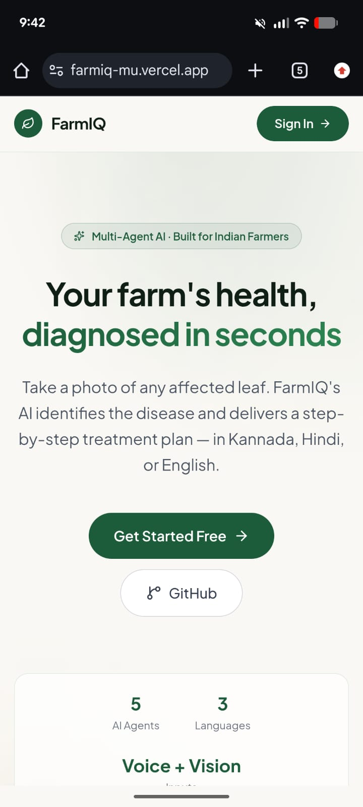
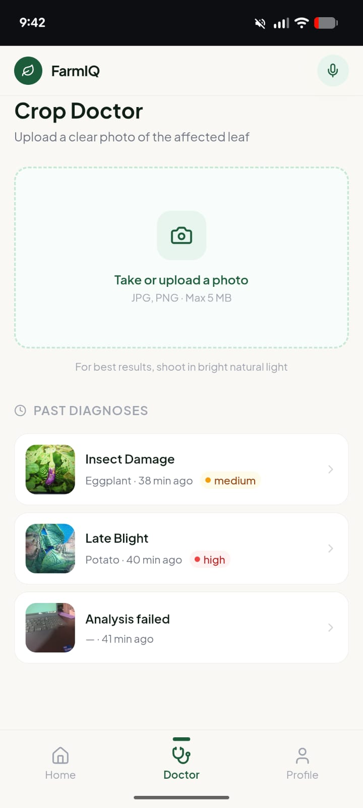
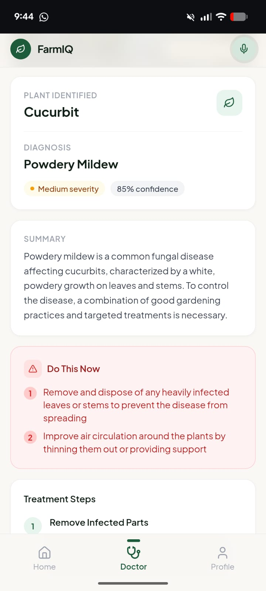
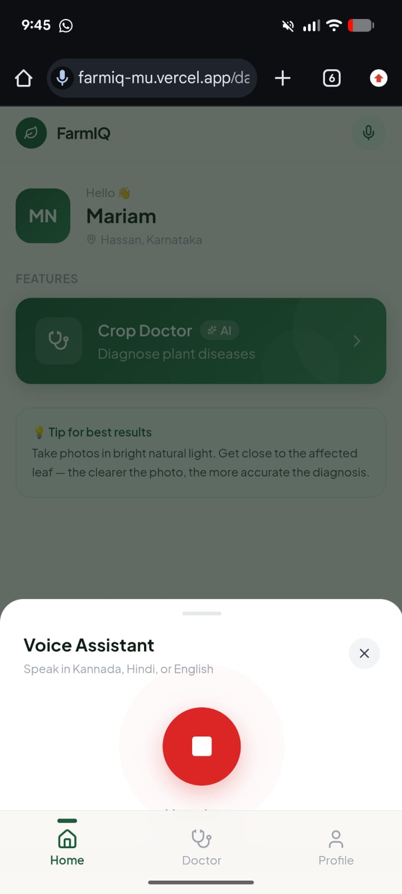

# FarmIQ

A multi-agent AI assistant that diagnoses plant diseases from photos and responds in Kannada, Hindi, or English.

**Live:** https://farmiq-mu.vercel.app


---

## Screenshots

## Screenshots

<p align="center">
  
  
  
  
</p>

---

## Overview

FarmIQ accepts a leaf photo or a voice query and returns a structured treatment plan in the user's preferred language. It is built for Indian farmers and home gardeners underserved by English-only AI tools.

---


---

## Tech Stack

- Next.js 16 (App Router), TypeScript, Tailwind CSS, Framer Motion
- Prisma 7 with `@prisma/adapter-pg`, Supabase Postgres
- Supabase Auth (Google OAuth), Supabase Storage (private buckets with signed URLs)
- Gemini, Groq, Sarvam APIs
- Deployed on Vercel

---


## Vision Benchmark


Overall: 60% crop, 50% disease, ~4s average latency.

The model performs well on visually distinctive diseases and underperforms on tomato leaf conditions. A production version would augment Gemini with a specialized classifier as a second opinion.

---


## Local Setup

```bash
git clone https://github.com/mariam-1209/farmiq.git
cd farmiq
pnpm install
cp .env.example .env
pnpm prisma db push
pnpm prisma generate
pnpm dev
```

Required environment variables: Supabase URL and keys, `DATABASE_URL`, `DIRECT_URL`, `GEMINI_API_KEY`, `GROQ_API_KEY`, `SARVAM_API_KEY`.

---

## License

MIT
